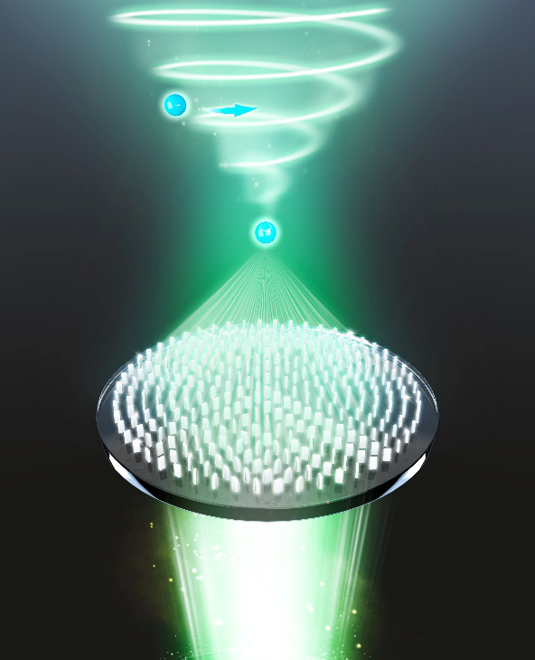
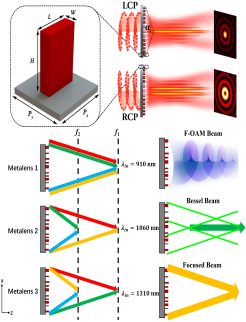
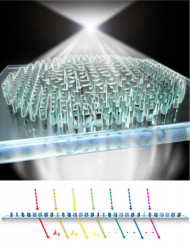
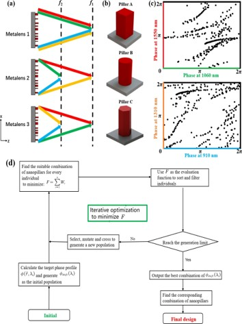

 Biography
======
__Boyan Fu__ received her B.S. degree in *Electronic Science and Technology* from Guangxi University, China, in 2020. She is now a M.S. student majoring in Optics at the [National Laboratory of Solid State Microstructures](https://vlssm.nju.edu.cn/), [School of Physics](https://physics.nju.edu.cn/) at Nanjing University, advised by [*Prof*. Shuming Wang](https://physics.nju.edu.cn/sz/gdkxx/20191105/i45277.html). She is now engaged in the research on Nanophotonics based on Metalenses for Hyperspectral imaging.

<!-- __Update: I will be joining Stanford University as a Ph.D. student in Fall 2021!__ -->

<!-- Research area
======

<strong>Metasurface-Based Optical Manipulation</strong>

  

 

Optical tweezers (OT) and optical spanner (OS) are powerful tools of optical manipulation, which are responsible for particle trapping and rotation, respectively. Conventionally, the OT and OS are built using bulky three-dimensional devices, such as microscope objectives and spatial light modulators. Recently, metasurfaces are proposed for setting up them on a microscale platform, which greatly miniaturizing the systems. In this topic, we offer a metasurface-based solution to integrating the OT and OS. Using the prevailing approach based on the geometric and dynamic phases, we show that it is possible to construct an output field, which promises a high NA focal spot, accompanied with a coaxial vortex. Optical trapping and rotation are numerically demonstrated by estimating the mechanical effects on a particle probe. Moreover, we demonstrate an on-demand control of the OT-to-OS distance and the topological charge possessed by the OS. Our results may empower advanced applications in on-chip particle manipulation.

  

 

<strong>Multidimensional Light-Field Manipulation with Metasurfaces</strong>

  

 

Metasurfaces possessing the advantages of miniaturized size, are widely employed to manipulate light in the subwavelength region, which breaks the limitation of bulky and complex volume and system compared to the traditional optical elements. An advantage of metasurfaces is their versatility by invoking the parameters of light-field to achieve various functionalities into a single-layer metasurface. In this project, we report methods of using the polarization and dispersion of light to achieve multifunctional metasurface devices, allowing the different degrees of freedom of light to carry independent phase profiles to achieve the polarization-dependent conversion of Bessel beams with different orders and NAs as well as wavelength-controlled multifunctional metalenses by introducing an improved genetic algorithm have been implemented. We envision our research are expected to be the potential candidates in multifunctional integrated optical devices.

  

 

<strong>Chromatic Dispersion Manipulation Based on Metalenses</strong>

  

 

Among all the optical elements, the metalenses possess most basic and important application, compared with the traditional lenses, it has significant advantages in integration and miniaturization. However, the resonant dispersion of each nanostructure, the inherent dispersion of planar devices and optical materials lead to large chromatic aberrations in the metalenses, that severely reduces the quality of their focusing and imaging. Therefore, how to effectively suppress or manipulate the chromatic aberration of metalenses has attracted worldwide attention in recent years, and various excellent achievements have promoted the development of this field. In this project, the Differencial-phase equation has been employed to design the achromatic or super chromatic metalenses, which provides the possibility for the development of ultrathin full-color camera or spectral imaging devices.

  

   -->

Publications
======

&nbsp; __1. Inhomogeneous chromatic dispersion manipulation based on supercell metalenses__ 
&nbsp; __Boyan Fu__, Tianyue Li, Quan yuan, Xiujuan Zou, Ruoyu Lin, Shuming Wang, Zhenlin Wang, Shining Zhu.  
&nbsp; *Coming soon 2022*  

&nbsp; __2. Wavelength-controlled multifunctional transmissive metalenses__ 
&nbsp; Jianzheng Ren, Tianyue Li, __Boyan Fu__, Shuming Wang, Zhenlin Wang, Shining Zhu.  
&nbsp; *Optical Materials Express 2022*  

 
 

&nbsp; __3. Integrating the optical tweezers and spanner onto an individual single-layer metasurface__ 
&nbsp; Tianyue Li, Xiaohao Xu, __Boyan Fu__, Shuming Wang, Baojun Li, Zhenlin Wang, Shining Zhu.  
&nbsp;  [*Photonics Research*](../files/PR. Integrating the optical tweezers and spanner onto an individual single-layer metasurface.pdf) *2021*  

&nbsp; __4. Multidimensional light field manipulation and applications based on optical metasurface__ 
&nbsp; Tianyue Li, __Boyan Fu__, Jianzheng Ren, Shuming Wang, Zhenlin Wang, Shining Zhu.  
&nbsp;  [*First Optics Frontier Conference*](../files/SPIE Conference.Multidimensional light field manipulation and applications based on optical metasurface.pdf) *2021*  

&nbsp; __5. Review: Chromatic Dispersion Manipulation Based on Optical Metasurfaces__ 
&nbsp; __Boyan Fu__, Xiujuan Zou, Tao Li, Shuming Wang, Zhenlin Wang, Shining Zhu.  
&nbsp;  [*Journal of Harbin Institute of Technology*](../files/Review_Chromatic Dispersion Manipulation Based on Optical Metasurfaces.pdf) *2020*  
<!--  -->

<!-- Industry Experience
======

&nbsp; __Creative Intelligence Lab, Adobe Research__ 
&nbsp; Research Intern with Dr. [Danny Kaufman](http://dannykaufman.io/) 
&nbsp; *<h style="color:rgb(150, 150, 150);font-size:16px">Project: Multi-Resolution Simulation</h>  *
&nbsp; &nbsp; &nbsp; &nbsp; &nbsp; &nbsp; &nbsp; &nbsp; &nbsp; &nbsp; &nbsp; &nbsp; &nbsp;
&nbsp; &nbsp; &nbsp; &nbsp; &nbsp; &nbsp; &nbsp; &nbsp; &nbsp; &nbsp; &nbsp; &nbsp; &nbsp; &nbsp;
&nbsp; &nbsp; &nbsp; &nbsp; &nbsp; &nbsp; &nbsp; &nbsp; &nbsp; &nbsp; &nbsp; &nbsp; &nbsp;&nbsp; &nbsp; &nbsp; &nbsp; &nbsp; &nbsp; &nbsp; &nbsp; &nbsp; &nbsp; &nbsp; &nbsp;May 2021 - Aug. 2021 
 

&nbsp; __Emerging Graphics Group, Adobe Research__ 
&nbsp; Research Intern with Dr. [Qi Sun](https://qisun.me/) 
&nbsp; *<h style="color:rgb(150, 150, 150);font-size:16px">Project: Skin Modeling</h>  *
&nbsp; &nbsp; &nbsp; &nbsp; &nbsp; &nbsp; &nbsp; &nbsp; &nbsp; &nbsp; &nbsp; &nbsp; &nbsp;
&nbsp; &nbsp; &nbsp; &nbsp; &nbsp; &nbsp; &nbsp; &nbsp; &nbsp; &nbsp; &nbsp; &nbsp; &nbsp; &nbsp;
&nbsp; &nbsp; &nbsp; &nbsp; &nbsp; &nbsp; &nbsp; &nbsp; &nbsp; &nbsp; &nbsp; &nbsp; &nbsp;&nbsp; &nbsp; &nbsp; &nbsp; &nbsp; &nbsp; &nbsp; &nbsp; &nbsp; &nbsp; &nbsp;June 2020 - Sept. 2020 

  -->

<!-- Teaching Experience
======
&#9679; __Teaching Assistant__, University of Toronto 
&nbsp; &nbsp; [CSC419/2520 Geometry Processing](https://github.com/alecjacobson/geometry-processing-csc2520) with Prof. [Alec Jacobson](https://www.cs.toronto.edu/~jacobson/)
&nbsp; &nbsp; &nbsp; &nbsp; &nbsp; &nbsp; &nbsp; &nbsp; Sept. 2020 - Jan. 2021 

  -->

<!-- Selected Projects
======

<strong>Fast Support Reduction</strong>

 In layer-based 3D fabrication, supporting structures are fabricated
to support overhanging regions yet discarded later. Reducing supports
saves both time and material cost. In this project, we propose 
a real-time skinning-based method to slim down the
supporting structure while maintaining a detailed-preserved and semantically meaningful geometry.
We achieve this by optimizing a set of performance objectives and searching globally in
the subspace spanned by the joint handles. Artifacts e.g. self-intersection can be effectively avoided.
Our method is implemented via OpenGL shaders and has potential to be
employed as a structural prototyping tool that facilitates model design and fabrication. 

 -->

Address
======
__Room 411A, TangZhongying Building, Jinyin Street, Nanjing__
 

E-mail
======
__MG20220199@smail.nju.edu.cn__
 

